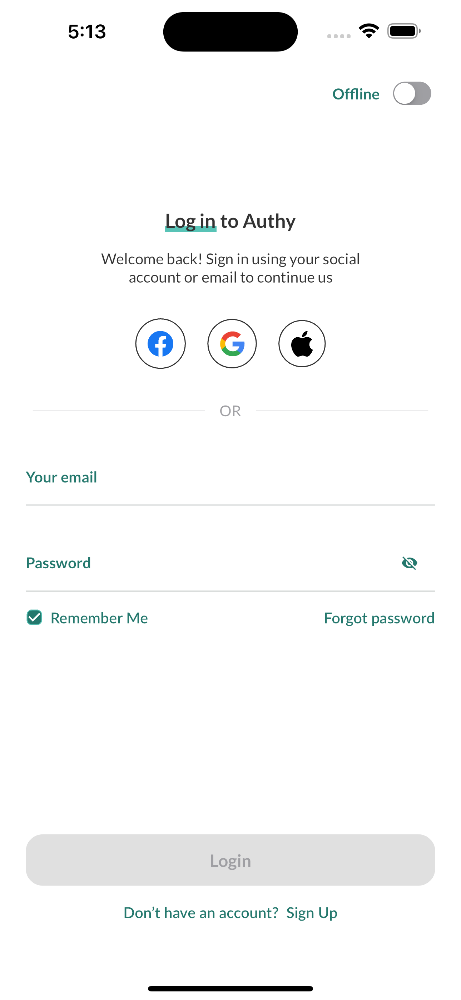
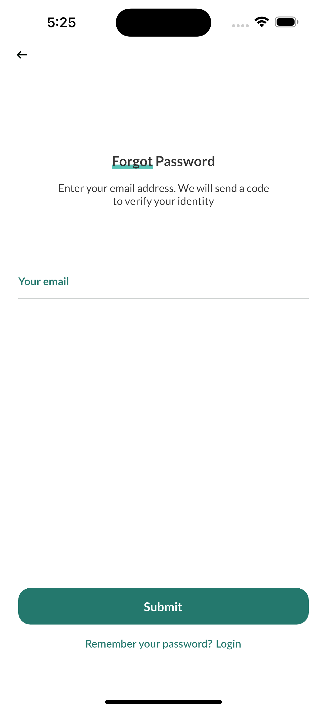
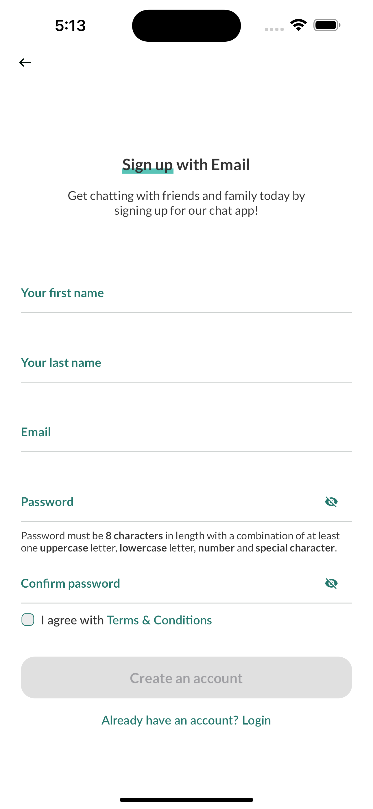
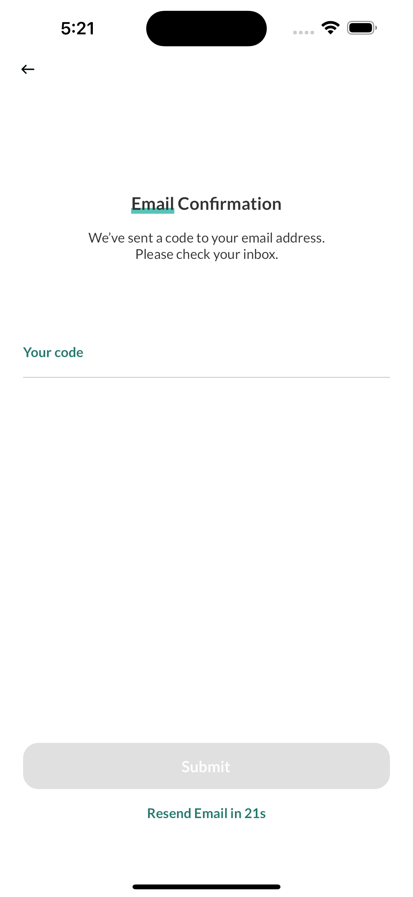
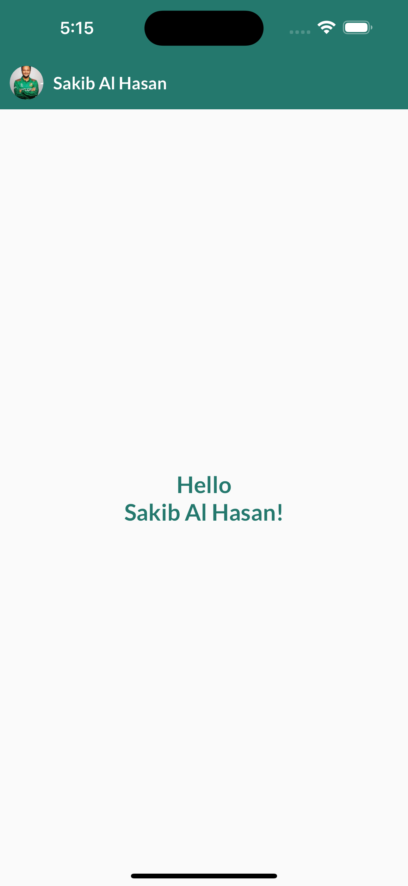
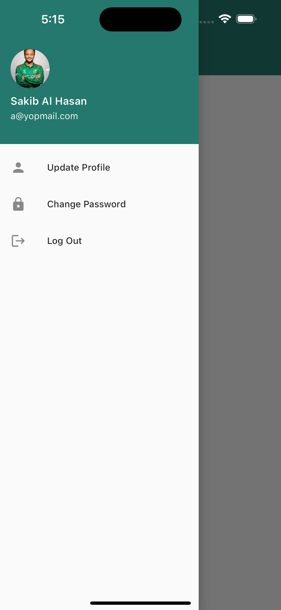
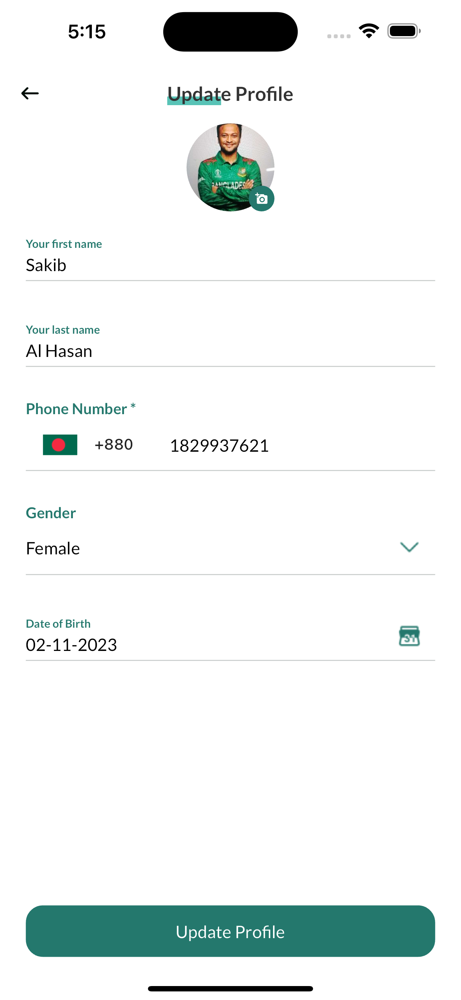
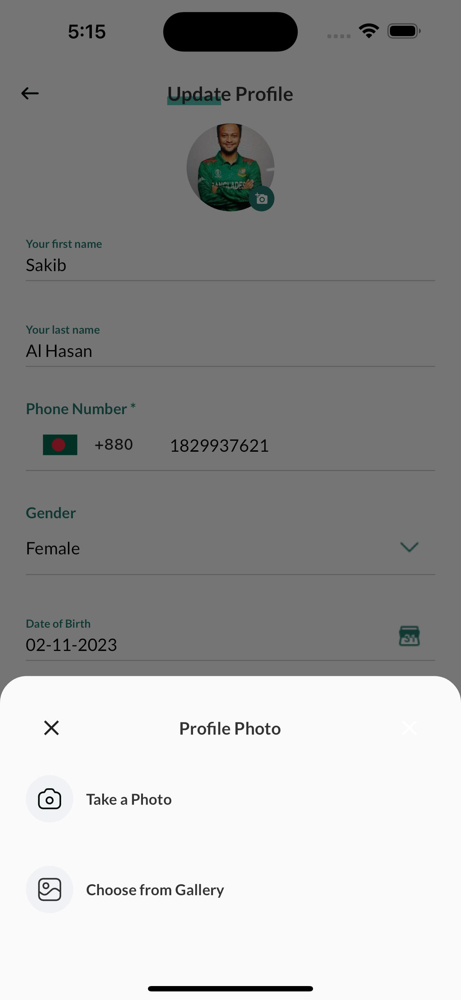
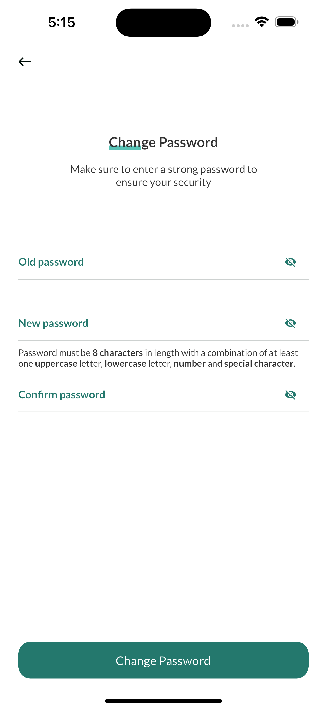

<p align="center">
  <a href="https://github.com/BrainStation-23/Flutter-Auth-Module"></a>
  <a href="https://github.com/BrainStation-23/Flutter-Auth-Module"></a>
  <a href="https://github.com/BrainStation-23/Flutter-Auth-Module/releases"></a>
  <a href="https://opensource.org/licenses/Apache-2.0"></a>
</p>


# Auth Module - Elevate Your Authentication Experience

<table>
  <tr>
    <td>
       
    <p>
    The Auth Module is a comprehensive and powerful set of features crafted to manage user authentication and profile-related functionalities within your Flutter application. With seamless integration of both online and offline capabilities, this module ensures a robust and user-friendly experience for handling user authentication.
      </p>
    </td>
  </tr>
</table>

## Features

- **🎨 Beautiful UI with multiple screens**
    - Provides a visually appealing user interface with multiple screens for a rich user experience.

- **📲 Fetch Device Information**
    - Retrieves device-specific information to enhance the application's functionality.

- **🔥 Connection with Firebase**
    - Establishes a connection with Firebase for various features and services.

- **🔐 Caching for Continuous Log-In**
    - Implements caching mechanisms to enable continuous log-in for users, enhancing their convenience.

- **📴 Offline Log-In**
    - Allows users to log in even when offline, ensuring uninterrupted access to the application.

- **🔒 Sign-In**
    - Enables users to securely sign in using their email and password.

- **📝 Sign-Up**
    - Facilitates the user registration process with essential information, including first name, last name, email, and password, with validation.

- **🚪 Log-Out**
    - Provides a mechanism for users to securely log out of their accounts.

- **📧 Forgot Password**
    - Allows users to initiate the password recovery process by providing their email.

- **🔑 Change Password**
    - Permits users to update their passwords securely.

- **🖼 Update Profile**
    - Empowers users to modify their profile information, including their image, first name, last name, phone number, gender, and date of birth.

- **👤 View Profile**
    - Displays user profile information, enabling users to review and verify their details.

- **📷 Image from Gallery and Camera**
    - Provides the capability for users to select and capture images from their device's gallery and camera.

- **✏️ Image Modification**
    - Supports image modification, allowing users to enhance and edit images.

- **📩 Email Confirmation**
    - Facilitates email confirmation as part of the registration process.

- **📶 OTP Verification**
    - Implements OTP verification for password reset and account security.

- **📱 One Device Log-In**
    - Ensures that users can log in from a single device for security and user experience consistency.


## Screenshots
<table>
  <tr>
    <td>LogIn Screen</td>
    <td>Forgot Screen</td>
    <td>SignUp Screen</td>
    <td>Email Confirmation Screen</td>
  </tr>
  <tr>
    <td>
      
    </td>
    <td>
      
    </td>
    <td>
      
    </td>
    <td>
      
    </td>
  </tr>
  <tr>
    <td>Home Screen</td>
    <td>Drawer Screen</td>
    <td>Update Profile Screen</td>
    <td>Update Photo Screen</td>
  </tr>
  <tr>
    <td>
      
    </td>
    <td>
      
    </td>
    <td>
      
    </td>
    <td>
      
    </td>
  </tr>
  <tr>
    <td>Change Password Screen</td>
    <td>WebView Page Screen</td>
  </tr>
  <tr>
    <td>
      
    </td>
    <td>
      
    </td>
  </tr>
</table>

## Application Architecture

The application was created using the clean-architecture. Flutter riverpod is used for state management.

### File Structure
A High-level overview of the project structure:
```

├── lib/                             # Root
│   ├── src/                         # Source code
│   │   ├── core/                    # Core 
│   │   └── feature/                 # All features
│   │       ├── authentication
│   │       ├── home
│   │       └── porfile
│   ├── firebase_options.dart
│   └── main.dart

.
└── home/                           # Feature
    ├── data/                       # Data layer
    │   ├── data_sources/           
    │   ├── models/                 
    │   └── repositories/           
    ├── domain/                     # Domain layer
    │   ├── entities/               
    │   ├── repositories/           
    │   └── use_cases/              
    └── presentation/               # Presentation layer
        ├── pages/                  
        └── widgets/                
```
## Dependencies

<details>
<summary>Dependencies</summary>

# Dependencies

This Flutter application relies on various packages to provide essential functionality. Here is a list of the dependencies used in this project:

- [cupertino_icons](https://pub.dev/packages/cupertino_icons): 1.0.2
- [connectivity_plus](https://pub.dev/packages/connectivity_plus): 4.0.2
- [dartz](https://pub.dev/packages/dartz): 0.10.1
- [flutter_screenutil](https://pub.dev/packages/flutter_screenutil): 5.8.4
- [flutter_bloc](https://pub.dev/packages/flutter_bloc): 8.1.3
- [flutter_riverpod](https://pub.dev/packages/flutter_riverpod): 2.4.0
- [equatable](https://pub.dev/packages/equatable): 2.0.5
- [get_it](https://pub.dev/packages/get_it): 7.6.0
- [dio](https://pub.dev/packages/dio): 5.1.1
- [pretty_dio_logger](https://pub.dev/packages/pretty_dio_logger): 1.3.1
- [logger](https://pub.dev/packages/logger): 1.1.0
- [flutter_network](https://pub.dev/packages/flutter_network): 1.0.0+2
- [shared_preferences](https://pub.dev/packages/shared_preferences): 2.2.0
- [flutter_svg](https://pub.dev/packages/flutter_svg): 2.0.7
- [intl](https://pub.dev/packages/intl): 0.18.1
- [fluttertoast](https://pub.dev/packages/fluttertoast): 8.2.2
- [webview_flutter](https://pub.dev/packages/webview_flutter): 4.2.2
- [webview_flutter_android](https://pub.dev/packages/webview_flutter_android): 3.8.1
- [webview_flutter_wkwebview](https://pub.dev/packages/webview_flutter_wkwebview): 3.6.1
- [firebase_core](https://pub.dev/packages/firebase_core): 2.15.0
- [device_info_plus](https://pub.dev/packages/device_info_plus): 9.0.1
- [image_picker](https://pub.dev/packages/image_picker): 1.0.1
- [permission_handler](https://pub.dev/packages/permission_handler): 11.0.0
- [country_code_picker](https://pub.dev/packages/country_code_picker): 3.0.0
- [flutter_image_compress](https://pub.dev/packages/flutter_image_compress): 2.0.4

</details>


## Crashlytics and Analytics
To enable Firebase Crashlytics and Analytics, do the following:

1. Create a new project in [console.firebase.google.com](https://console.firebase.google.com/).Call the Firebase project whatever you like; just **remember the name**.You don't need to enable Analytics in the project if you don't want to.
2. [Install `firebase-tools`](https://firebase.google.com/docs/cli?authuser=0#setup_update_cli) on your machine.
3. [Install `flutterfire` CLI](https://firebase.flutter.dev/docs/cli#installation) on your machine.
4. In the root of this project (the directory containing `pubspec.yaml`), run the following:
- `flutterfire configure`
    - This command asks you for the name of the Firebase project that you created earlier, and the list of target platforms you support.As of April 2022, only `android` and `ios` are fully supported by Crashlytics.
    - The command rewrites `lib/firebase_options.dart` with the correct code.
5. Go to `lib/main.dart` and uncomment the lines that relate to Crashlytics and Analytics.
   You should now be able to see crashes, errors, and severe log messages in [console.firebase.google.com](https://console.firebase.google.com/).To test, add a button to your project, and throw whatever exception you like when the player presses it.

## Building the project

* To run the **Flutter project**,open it in your editor, first run `pub get` of network module initially, then run `pub get` of the auth-module-app and click the play button, or run `flutter run` on your terminal.

## Contributing

Contributions are welcome!
However, if it's going to be a major change, please create an issue first.
Before starting to work on something, please comment on a specific issue and say you'd like to work on it.
